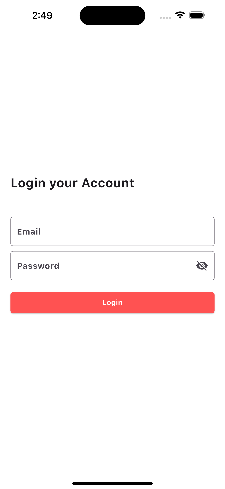
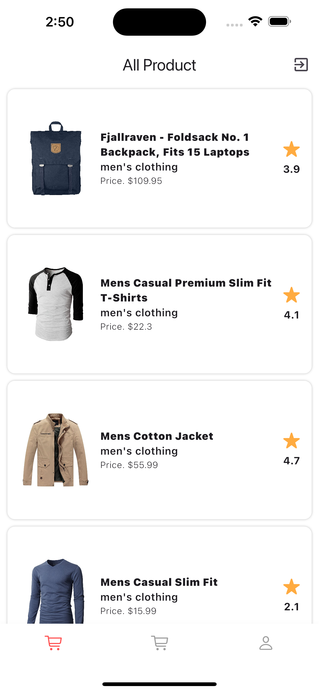

# ecommerce_api

A new Flutter project.

.
.
.
.
.
.

## Getting Started

This project is a starting point for a Flutter application.

A few resources to get you started if this is your first Flutter project: