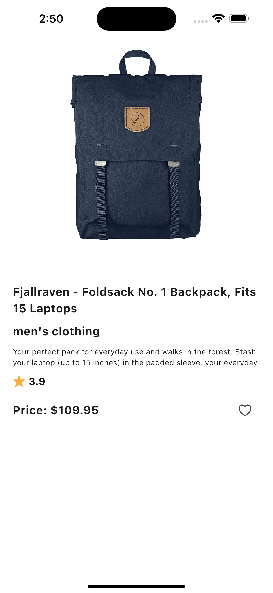

# E-Commerce App:
Developed a robust and scalable e-commerce application with a focus on clean code and modern development practices. Key highlights include:
### Clean Code and Best Practices:
Followed the SOLID Principles to ensure maintainable, flexible, and scalable code.
Adopted the MVVM Architecture for a clear separation of concerns and enhanced testability.
### RESTful API Integration:
Integrated a fake REST API to handle product listings, user authentication, cart management, and order processing.
Ensured efficient data handling with well-structured API calls and responses.
### Features:
User-friendly product browsing and detailed product pages. Seamless cart management and checkout process. Authentication system with secure login and registration.

<table>
  <tr>
    <td></td>
    <td></td>
    <td></td>
  </tr>
  <tr>
    <td></td>
    <td></td>
    <td></td>
  </tr>
</table>